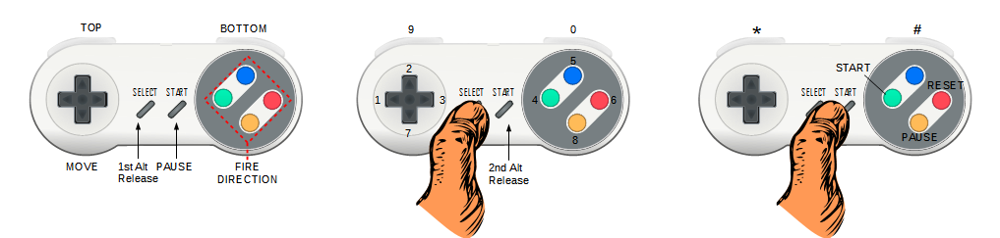

# Murray
SNES to dual Joystick adapter for Atari 5200 

This adapter was named after The 8 Bit Guy that came with a SNES layout for a game that he is developing (for Commodore PET/64) that have controls very similar to Robotron, where the directional Pad controls the movement while the X Y A B buttons control the shooting direction.

## Button Mapping

Full keyboard control is provided using the SELECT and START buttons as Alt/Modifiers keys.

